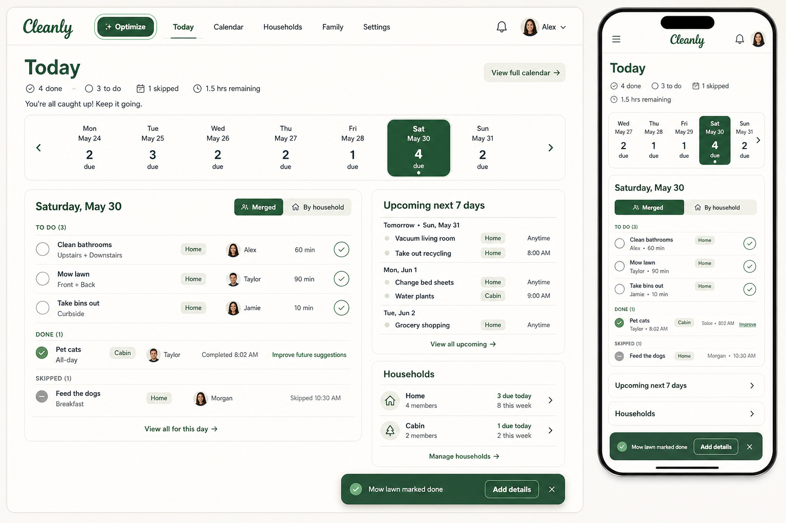

# Home Navigation + Today Operating Dashboard Design

Date: 2026-05-31

## Summary

This milestone updates the authenticated product experience now that app-owned chores and calendar occurrences are functional. It combines three related efforts:

- Emphasize `Optimize` in the authenticated header without changing the post-auth landing page.
- Revamp `Today` into an operating dashboard for due and upcoming chores.
- Run a core app UI refresh so authenticated pages feel consistent with the more operational, compact direction explored in the mockup reference.

The selected mockup is an example direction, not a pixel-perfect requirement:

## Product Direction

Signed-in visits to `/` still open `Today`. The header should place `Optimize` before `Today` and give it a stronger visual treatment so planning guidance is easy to discover. `Today` remains the daily home view, focused on what needs attention now.

The `Today` dashboard should use a calendar-strip structure:

- A compact hero and summary.
- A seven-day strip that shows due counts only.
- A selected-day chore list showing planned, completed, and skipped rows.
- A merged feed across households by default, with a `Merged / By household` toggle for multi-household users.
- An upcoming chores widget for the next seven days.
- A household summary widget below the operational chore surfaces.

Google Calendar setup should move off `Today` and into the `Calendar` page as a secondary setup/import CTA that links to `/settings#calendar` until real integration is implemented.

## Completion UX

Today should support fast completion for chores assigned to the current user. Other users' chores remain visible but view-only.

When a chore is completed from Today:

- The app posts a normal occurrence completion with default check-in values.
- The row moves into completed styling.
- A toast confirms the completion and offers `Add details`.
- The completed row also exposes a quiet `Improve future suggestions` action.

The details action should open a lightweight modal or sheet with the existing check-in questions. Saving it should update the completion check-in without making optimization feel mandatory.

## UI Refresh

The mockup reference is a useful starting point for hierarchy and tone: compact operational panels, warm off-white surfaces, restrained green emphasis, row-based task controls, and mobile-first stacking. The implementation should determine a good UI solution from that direction and apply it across core authenticated surfaces: `Today`, `Calendar`, `Optimize`, `Households`, `Family`, and `Settings`.

This refresh should avoid oversized marketing-style heroes inside authenticated workflows. The app should feel like a practical household operations tool: dense enough for repeated daily use, calm enough to scan quickly, and consistent across pages.

## Implementation Notes

The current Calendar APIs already provide the main building blocks:

- `listOccurrences` for range loading.
- `completeOccurrence` for fast completion.
- `listHouseholdMembers` for assignee labels.

Today will need to load occurrences for each household across the selected seven-day range and merge them client-side for the default view. Household labels should appear on rows when more than one household is present.

A small backend/API addition is needed for optional post-completion feedback: an endpoint that updates the existing completion check-in record for a completed occurrence, reusing `CompletionCheckInInput`.

## Acceptance Criteria

- `Optimize` is the first authenticated nav item and receives a distinct emphasis treatment.
- `/` still routes signed-in users to `Today`.
- `Today` shows the seven-day due-count strip and selected-day all-status chore list.
- Quick completion is available only for chores assigned to the current user.
- Completing a chore from Today updates the row, shows a toast, and leaves an optional feedback path.
- Multi-household users can switch from merged feed to grouped household sections.
- `Today` no longer shows the Google Calendar setup CTA.
- `Calendar` includes the Google Calendar setup/import CTA.
- The core authenticated app shares the refreshed visual direction while preserving existing functionality.
- Desktop and mobile browser checks cover `Today`, `Calendar`, `Optimize`, `Households`, `Family`, and `Settings`.
